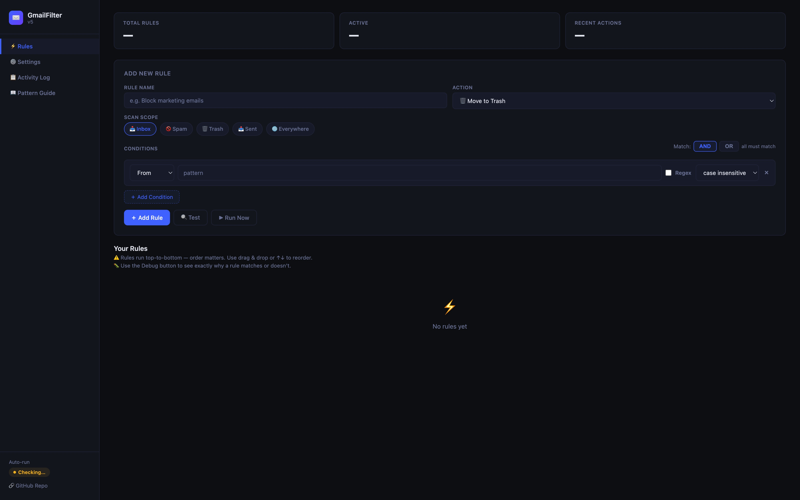

# Gmail Filter App

A Google Apps Script app for building custom Gmail filtering rules with a simple UI.

It lets you:

- scan selected Gmail areas like `Inbox`, `Spam`, `Trash`, `Sent`, or `Everywhere`
- create multi-condition rules using `AND` / `OR`
- match email `From`, `To`, `Subject`, and `Body`
- choose between `Contains`, `Equals`, and `Regex` matching
- automatically `trash`, `archive`, `label`, `star`, `mark read`, or `delete`
- review activity logs and debug why a rule matched

The app runs on a time trigger in the background and keeps checking for new emails based on your configured interval.

## How It Works

You create rules in the UI.

Each rule can contain one or more conditions, for example:

- `From` equals `example.us@gmail.com`
- `Body` regex matches `\blet me in\b`

When a message matches a rule, the selected action is applied to that message.

Rules run from top to bottom, so order matters.

## Install

1. Go to [script.google.com](https://script.google.com).
2. Create a new Apps Script project.
3. Replace the default files with this project:
   - copy `Code.gs`
   - copy `Ui.html`
4. Save the project.
5. Enable the Gmail advanced service if you are prompted to do so.
   - In Apps Script: `Services` → add `Gmail API`
6. Deploy the project as a web app.
   - In Apps Script: `Deploy` → `New deployment`
   - Select type: `Web app`
   - Execute as: `Me`
   - Who has access: your preferred setting for your account and usage
7. Open the deployed web app URL once to confirm the UI loads.
8. Run the app once from Apps Script so Google can request permissions.
9. Authorize access to your Gmail.
10. Open the deployed web app UI and create your rules.
11. Activate auto-run so it keeps working in the background.

After authorization, it can run silently in the background on the configured schedule.

## Deploy Notes

This app is not usable from the editor alone. Because it serves the interface through `doGet()`, users must create an Apps Script `Web app` deployment and open that deployment URL to access the UI.

After redeploying or changing `Code.gs`, stop auto-run in the UI and activate it again. This deletes the existing scheduled `runFilters` trigger and creates a fresh one, which helps avoid stale or duplicate trigger behavior.

## First Run

Recommended setup:

1. Create one simple rule first.
2. Use `Contains` mode unless you specifically need `Equals` or `Regex`.
3. Use `Test` before enabling a destructive action.
4. Use `🐛 Debug` if a rule behaves unexpectedly.
5. Start with `archive`, `label`, or `mark read` before using `trash` or `delete`.

## Matching Modes

Each condition has three modes:

- `Contains`
  - matches when the field includes the text anywhere
  - safest default
  - good for phrases, domains, sender fragments, or subject keywords
- `Equals`
  - matches only when the whole field equals the value
  - useful for strict sender / recipient matching
- `Regex`
  - uses normal regular expression rules
  - useful for flexible matching patterns
  - example: `.*@gmail\.com`

Case options:

- `case insensitive`
- `case sensitive`
- `multiline` for regex only

`multiline` means `^` and `$` can match the start and end of each line, not only the whole field.

## Example Rules

Equals sender plus contains phrase:

- `From` → `Equals` → `example.us@gmail.com`
- `Body` → `Contains` → `let me in`
- Logic: `AND`

Regex sender:

- `From` → `Regex` → `.*@gmail\.com`

Whole word in body:

- `Body` → `Regex` → `\blet me in\b`

Multiple spam keywords:

- `Subject` → `Regex` → `sale|promo|deal`

## Rule Actions

Available actions include:

- move to trash
- permanently delete
- archive
- add label
- add label and archive
- add label and trash
- star
- mark read

## Pattern Tips

- Use `Contains` unless you specifically need `Equals` or `Regex`.
- Use `Equals` when the whole field must match exactly.
- In regex, `.` means any character.
- In regex, `\.` means a literal dot.
- For body rules, be careful with replies: old quoted text can still appear in the body.
- Combine body rules with a `From` condition when possible.

## Debugging

If something matches unexpectedly:

1. Open the rule.
2. Use `Test` to check recent matching messages.
3. Use `🐛 Debug` to inspect why each condition passed or failed.
4. Check `Activity Log` to see which rule matched and what action ran.

## Notes

- The app works on messages, not entire conversations, for actions triggered by rules.
- Rules are evaluated in order from top to bottom.
- Drag and drop can be used to reorder rules.
- Background execution depends on Apps Script triggers and Google quotas.

## Security / Permissions

The script needs Gmail access because it reads messages and applies actions like trashing, archiving, labeling, and marking read.

Only install it in a Google account you control and trust.

## Project Files

- `Code.gs`: server-side Apps Script logic
- `Ui.html`: web UI
